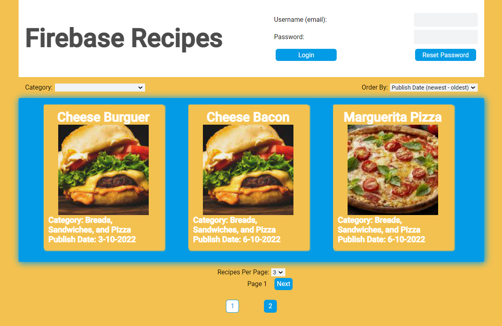

## 
 Firebase Recipes

* Instituição: Udemy
* [Curso: Learn Firebase Core With React](https://www.udemy.com/course/learn-firebase/)
* Projeto Publicado: https://fir-recipes-99b2b.web.app/

## Descrição do projeto
Firebase Recipes foi desenvolvido no curso Learn Firebase Core with React da Udemy. Nesse projeto, foi estudado as funcionalidades dos serviços Firebase Authentication, Firestore, Storage, e Functions. 
 O projeto consiste de um site de receitas com sistema de administração. Sem autenticação, o sistema mostra receitas com status de publicadas. Com autenticação, o sistema mostra todas as receitas disponíveis, e também libera a opção de adicionar novas receitas ou editar/excluir as existentes. 
 No final o projeto foi refatorado utilizando o Firebase Functions com Express API para criar os métodos GET, POST, PUT e DELETE para as operações com as receitas.
 O projeto foi desenvolvido por mim em Typescript. No curso o desenvolvimento original é em Javascript.

## Funcionalidades
* Sem autenticação
  * Visualizar todas as receitas com status publicadas
* Autenticado
  * Editar receitas existentes
  * Deletar receitas existentes
  * Adicionar novas receitas

## Ferramentas utilizadas
* Firebase Hosting para publicar o projeto;
* Firebase Authentication, Firestore, Storage e Functions;
* Express API

## Tecnologias utilizadas
* 
* 

## Autores
| [ Diego Ferreira](https://github.com/diegonf) | 
| :---: |